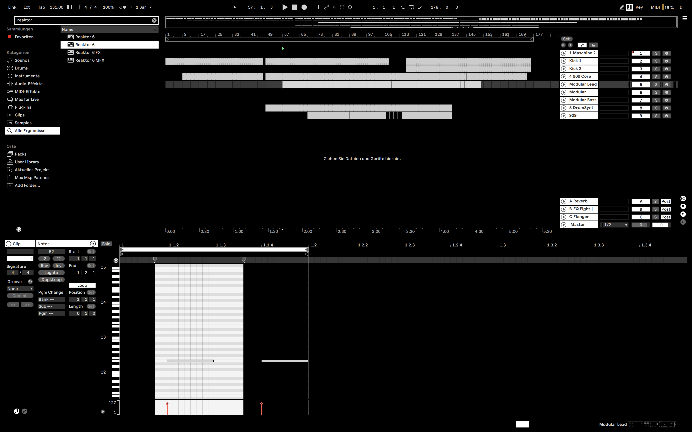

# Ableton Live Themes

This is a repository of custom Ableton live themes.
To install a theme place the .ask file in your live installation folder under '{Live Folder}/Content/App Resources/Themes'

## Themes

**HAUD Monochrome**

